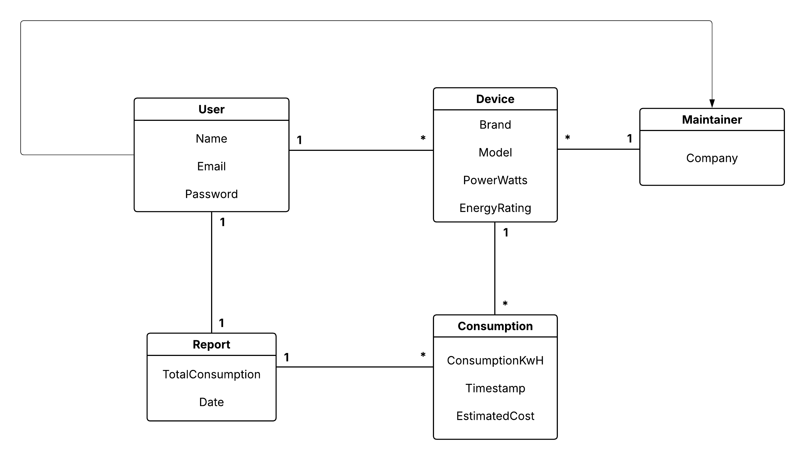
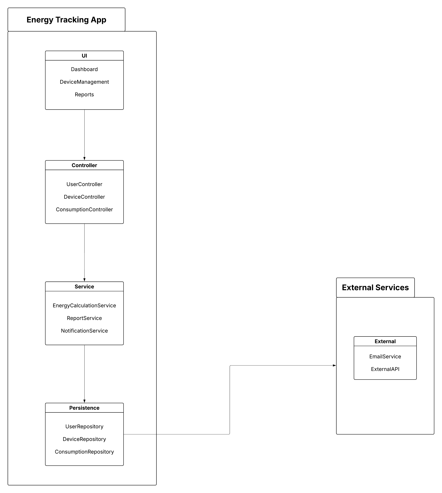
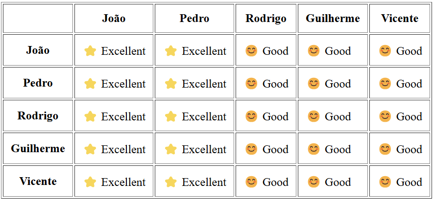

# EcoTracker Development Report

Welcome to the documentation pages of EcoTracker!

This Software Development Report, tailored for LEIC-ES-2024-25, provides comprehensive details about EcoTracker, from high-level vision to low-level implementation decisions. It’s organised by the following activities. 

* [Business modeling](#Business-Modelling) 
  * [Product Vision](#Product-Vision)
  * [Features and Assumptions](#Features-and-Assumptions)
  * [Elevator Pitch](#Elevator-pitch)
* [Requirements](#Requirements)
  * [User stories](#User-stories)
  * [Domain model](#Domain-model)
* [Architecture and Design](#Architecture-And-Design)
  * [Logical architecture](#Logical-Architecture)
  * [Physical architecture](#Physical-Architecture)
  * [Vertical prototype](#Vertical-Prototype)
* [Project management](#Project-Management)
  * [Sprint 0](#Sprint-0)
  * [Sprint 1](#Sprint-1)
  * [Sprint 2](#Sprint-2)
  * [Sprint 3](#Sprint-3)
  * [Sprint 4](#Sprint-4)
  * [Final Release](#Final-Release)

Contributions are expected to be made exclusively by the initial team, but we may open them to the community, after the course, in all areas and topics: requirements, technologies, development, experimentation, testing, etc.

Please contact us!

Thank you!

* Guilherme Nereu (up202303628@edu.fe.up.pt)
* João Lopes (up202307809@edu.fe.up.pt)
* Pedro Monteiro (up202307242@edu.fe.up.pt)
* Rodrigo Soares (up202303695@edu.fe.up.pt)
* Vicente Silva (up202303702@edu.fe.up.pt)

---
## Business Modelling

Business modeling in software development involves defining the product's vision, understanding market needs, aligning features with user expectations, and setting the groundwork for strategic planning and execution.

### Product Vision

<!-- 
Start by defining a clear and concise vision for your app, to help members of the team, contributors, and users into focusing their often disparate views into a concise, visual, and short textual form. 

The vision should provide a "high concept" of the product for marketers, developers, and managers.

A product vision describes the essential of the product and sets the direction to where a product is headed, and what the product will deliver in the future. 

**We favor a catchy and concise statement, ideally one sentence.**

We suggest you use the product vision template described in the following link:
* [How To Create A Convincing Product Vision To Guide Your Team, by uxstudioteam.com](https://uxstudioteam.com/ux-blog/product-vision/)

To learn more about how to write a good product vision, please see:
* [Vision, by scrumbook.org](http://scrumbook.org/value-stream/vision.html)
* [Product Management: Product Vision, by ProductPlan](https://www.productplan.com/glossary/product-vision/)
* [How to write a vision, by dummies.com](https://www.dummies.com/business/marketing/branding/how-to-write-vision-and-mission-statements-for-your-brand/)
* [20 Inspiring Vision Statement Examples (2019 Updated), by lifehack.org](https://www.lifehack.org/articles/work/20-sample-vision-statement-for-the-new-startup.html)
-->

EcoTracker is an application that allows users to track the energy consumption of their appliances while enabling companies to register their products with accurate consumption data. The platform provides greater transparency and control over energy usage, promoting efficiency and sustainability, "bringing clarity to your energy consumption for a greener future."

The goal for our app is to revolutionize energy efficiency by providing our customers with a tool that lets them be aware of their energy consumption and waste, promoting sustainability and a greener future, while also facilitating the access and selling of appliances by allowing manufacturers to provide detailed information about their products. That is why our motto is "Empowering consumers and businesses for a more sustainable future."

### Features and Assumptions
<!-- 
Indicate an  initial/tentative list of high-level features - high-level capabilities or desired services of the system that are necessary to deliver benefits to the users.
 - Feature XPTO - a few words to briefly describe the feature
 - Feature ABCD - ...
...

Optionally, indicate an initial/tentative list of assumptions that you are doing about the app and dependencies of the app to other systems.
-->
- User Authentication –> Users can log in securely with their google accounts to mantain their preferences and data every time they enter the app.

- Add Devices -> The app allows users to add their own devices, that will be stored in a database, as well as their characteristics.

- Maintainer Mode -> If a user classifies as a mantainer in some company, he will get the ability to add the company's new devices or release versions.

- Track Consumption -> The users will be allowed to introduce information about the time they used an equipment, the app automatically converts that time to energy usage.

- Tips -> The app provides a daily tip to help users reduce their energy consumptions.

- Warnings -> The app warns the user of an eventual increase, regarding the general consumption or even of some particular device.

- Stats -> The user has the possibility to see all the statistics about their devices consumption throughout time.

- Consumption Resume -> The user will be given a resume of the monthly consumptions.

### Elevator Pitch

Energy waste and high electricity costs are major problems for both consumers and manufacturers. Many people have no clear understanding of how much energy their appliances consume, leading to inefficiency and unnecessary expenses. This is where our app comes in handy. Our platform empowers users with insights into their energy consumption so they can optimize usage, save money, and protect the planet by reducing their footprint. On the other side, we have manufacturers—our app provides them the opportunity to showcase their products with accurate data, improving their relationships with clients and boosting their sales. With EcoTracker, we aim to reduce the gap between energy efficiency and sustainability, bringing clarity to energy consumption and paving the way for a greener future. 
<!-- 
Draft a small text to help you quickly introduce and describe your product in a short time (lift travel time ~90 seconds) and a few words (~800 characters), a technique usually known as elevator pitch.

Take a look at the following links to learn some techniques:
* [Crafting an Elevator Pitch](https://www.mindtools.com/pages/article/elevator-pitch.htm)
* [The Best Elevator Pitch Examples, Templates, and Tactics - A Guide to Writing an Unforgettable Elevator Speech, by strategypeak.com](https://strategypeak.com/elevator-pitch-examples/)
* [Top 7 Killer Elevator Pitch Examples, by toggl.com](https://blog.toggl.com/elevator-pitch-examples/)
-->

## Requirements

### User Stories
<!-- 
In this section, you should describe all kinds of requirements for your module: functional and non-functional requirements.

For LEIC-ES-2024-25, the requirements will be gathered and documented as user stories. 

Please add in this section a concise summary of all the user stories.

**User stories as GitHub Project Items**
The user stories themselves should be created and described as items in your GitHub Project with the label "user story". 

A user story is a description of a desired functionality told from the perspective of the user or customer. A starting template for the description of a user story is *As a < user role >, I want < goal > so that < reason >.*

Name the item with either the full user story or a shorter name. In the “comments” field, add relevant notes, mockup images, and acceptance test scenarios, linking to the acceptance test in Gherkin when available, and finally estimate value and effort.

**INVEST in good user stories**. 
You may add more details after, but the shorter and complete, the better. In order to decide if the user story is good, please follow the [INVEST guidelines](https://xp123.com/articles/invest-in-good-stories-and-smart-tasks/).

**User interface mockups**.
After the user story text, you should add a draft of the corresponding user interfaces, a simple mockup or draft, if applicable.

**Acceptance tests**.
For each user story you should write also the acceptance tests (textually in [Gherkin](https://cucumber.io/docs/gherkin/reference/)), i.e., a description of scenarios (situations) that will help to confirm that the system satisfies the requirements addressed by the user story.

**Value and effort**.
At the end, it is good to add a rough indication of the value of the user story to the customers (e.g. [MoSCoW](https://en.wikipedia.org/wiki/MoSCoW_method) method) and the team should add an estimation of the effort to implement it, for example, using points in a kind-of-a Fibonnacci scale (1,2,3,5,8,13,20,40, no idea).

-->

- As a user, I want to monitor the average consumption of my appliances in either a personal or business environment, so that I can better understand my energy usage, compare different appliances, and receive suggestions to optimize efficiency.

- As a user, I want to add my household appliances to the app and log their estimated consumption, so that I can track expenses over time, identify high-consumption devices, and receive suggestions for reducing energy costs.

- As a user I want to know how appliances compare to each other so that I know which one is the best for my use case.

- As a maintainer in a home appliance company, I want to add our products to the app so that users can add them more easily.

- As a maintainer in a home appliance company, I want to market our devices in the app so that users know about our company.

- As a maintainer in a home appliance company, I want to see how many users are using our appliances so that we can keep track of our most used products.

### Domain model

 

  

**User**
Represents the users of the application, containing essential information such as name, email and password. A user can add devices and receive notifications related to energy consumption.

**Device**
Models the monitored appliances, storing information such as brand, model, power and energy rating. Each device belongs to a user and records energy consumption data.

**Consumption**
Records the energy consumption of devices, including the amount of energy used (kWh), a timestamp to indicate when consumption was recorded and an estimate of the cost.

**Report**
Stores aggregated information about total energy consumption in a given period, including the date the report was generated.

**Maintainer**
Represents companies responsible for adding information about devices, allowing users to choose models from a predefined database.

## Architecture and Design
<!--
The architecture of a software system encompasses the set of key decisions about its organization. 

A well written architecture document is brief and reduces the amount of time it takes new programmers to a project to understand the code to feel able to make modifications and enhancements.

To document the architecture requires describing the decomposition of the system in their parts (high-level components) and the key behaviors and collaborations between them. 

In this section you should start by briefly describing the components of the project and their interrelations. You should describe how you solved typical problems you may have encountered, pointing to well-known architectural and design patterns, if applicable.
-->

### Logical architecture

  

### Physical architecture

  

### Vertical prototype
<!--
To help on validating all the architectural, design and technological decisions made, we usually implement a vertical prototype, a thin vertical slice of the system integrating as much technologies we can.

In this subsection please describe which feature, or part of it, you have implemented, and how, together with a snapshot of the user interface, if applicable.

At this phase, instead of a complete user story, you can simply implement a small part of a feature that demonstrates thay you can use the technology, for example, show a screen with the app credits (name and authors).
-->
- For our vertical prototype, we have implemented the adding of devices to the user's account. Meaning, each user can have their own set of custom devices, which will be important for the energy tracking features that we expect to deliver.
- We also implemented an authentication mechanism using Firebase and Google Sign-In, so that users can access their info without losing any data.

  

## Project management
<!--
Software project management is the art and science of planning and leading software projects, in which software projects are planned, implemented, monitored and controlled.

In the context of ESOF, we recommend each team to adopt a set of project management practices and tools capable of registering tasks, assigning tasks to team members, adding estimations to tasks, monitor tasks progress, and therefore being able to track their projects.

Common practices of managing agile software development with Scrum are: backlog management, release management, estimation, Sprint planning, Sprint development, acceptance tests, and Sprint retrospectives.

You can find below information and references related with the project management: 

* Backlog management: Product backlog and Sprint backlog in a [Github Projects board](https://github.com/orgs/FEUP-LEIC-ES-2023-24/projects/64);
* Release management: [v0](#), v1, v2, v3, ...;
* Sprint planning and retrospectives: 
  * plans: screenshots of Github Projects board at begin and end of each Sprint;
  * retrospectives: meeting notes in a document in the repository, addressing the following questions:
    * Did well: things we did well and should continue;
    * Do differently: things we should do differently and how;
    * Puzzles: things we don’t know yet if they are right or wrong… 
    * list of a few improvements to implement next Sprint;

-->

### Sprint 0

Initial GitHub Project screenshot:

  

Final GitHub Project screenshot:

  

Product release - version 0.1.0.

Restrospectives:
- What did well: we achieved what we planned for this sprint, with all uml's done, populated our main README file and implemented the vertical prototype that we intended (Add a device).
- What should we do differently: for the next sprint, we will need to better organize ourselves, and try to communicate more with other team members, as well as, making sure we are at the same rhythm.

### Sprint 1

Initial GitHub Project screenshot:

  

Final GitHub Project screenshot:

  

Product release - version 0.2.0

Retrospectives:
- What did well: we achieved what we planned for this sprint, with the option to add and remove devices, as well as a new tip of the day feature in the home screen and also a new profile page where the user can now sign out. We also did some things that were not planned as we had a little bit of extra time, such as, added a functional dark mode toggle and added an onRefresh function to the general page with the devices page working.
- What should we do differently: better organize the project issues across team members and a better sprint planning, so some people have easy issues and others difficult ones.

Happiness Meters:

  

### Sprint 2

Vertical prototype:

    

Initial GitHub Project screenshot:

  

Final GitHub Project screenshot:

  

Product release - version 0.3.0

Retrospectives:
- What did well: we achieved what we planned for this sprint, statistics page all working with the log device usage functionality and now our app has maintainers from companies who can add home appliances for users to add them more easily.
- What should we do differently: better organize the project issues across team members and a better sprint planning. Start coding right at the beginning of the sprint.

Happiness Meters(sprint2):

<table border="1" cellspacing="0" cellpadding="10">
  <tr>
    <th></th>
    <th>João</th>
    <th>Pedro</th>
    <th>Rodrigo</th>
    <th>Guilherme</th>
    <th>Vicente</th>
  </tr>
  <tr>
    <th>João</th>
    <td>⭐ Excellent</td>
    <td>⭐ Excellent</td>
    <td>😒 Fair</td>
    <td>😒 Fair</td>
    <td>😒 Fair</td>
  </tr>
  <tr>
    <th>Pedro</th>
    <td>⭐ Excellent</td>
    <td>⭐ Excellent</td>
    <td>😒 Fair</td>
    <td>😒 Fair</td>
    <td>😒 Fair</td>
  </tr>
  <tr>
    <th>Rodrigo</th>
    <td>⭐ Excellent</td>
    <td>⭐ Excellent</td>
    <td>😊 good</td>
    <td>😊 good</td>
    <td>😊 good</td>
  </tr>
  <tr>
    <th>Guilherme</th>
    <td>⭐ Excellent</td>
    <td>⭐ Excellent</td>
    <td>😊 good</td>
    <td>😊 good</td>
    <td>😊 good</td>
  </tr>
    <th>Vicente</th>
    <td>⭐ Excellent</td>
    <td>⭐ Excellent</td>
    <td>😊 good</td>
    <td>😊 good</td>
    <td>😊 good</td>
 
</table>
### Sprint 3

### Sprint 4

### Final Release

